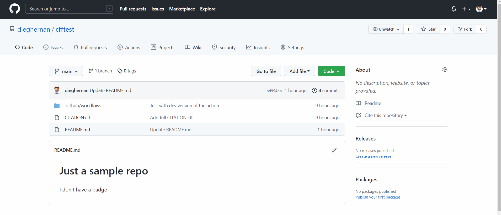

# cff-validator

 [](https://github.com/dieghernan/cff-validator/actions/workflows/cff-validator.yml) [](https://doi.org/10.5281/zenodo.5348444)

A GitHub action to validate `CITATION.cff` files with R.

## Introduction

If you have a [Citation File Format (cff)](https://citation-file-format.github.io) on your repository this action would check its validity against the defined [schema](https://github.com/citation-file-format/citation-file-format/blob/main/schema-guide.md).

A full valid workflow:

``` yaml
on:
  push:
    paths:
      - CITATION.cff
    workflow_dispatch:

name: CITATION.cff
jobs:
  Validate-CITATION-cff:
    runs-on: ubuntu-latest
    name: Validate CITATION.cff
    env:
      GITHUB_PAT: ${{ secrets.GITHUB_TOKEN }}
      RSPM: "https://packagemanager.rstudio.com/cran/__linux__/focal/latest"

    steps:
      - name: Checkout
        uses: actions/checkout@v2

      # This is needed for workflows running on
      # ubuntu-20.04 or later
      - name: Install V8
        if: runner.os == 'Linux'
        run: |
          sudo apt-get install -y libv8-dev
      - name: Validate CITATION.cff
        uses: dieghernan/cff-validator@main

      # Upload artifact
      - uses: actions/upload-artifact@v2
        if: failure()
        with:
          name: citation-cff-errors
          path: citation_cff_errors.md
```

On error, the action shows the results of the validation highlighting the fields with errors.

It also generates an [artifact](https://github.com/actions/upload-artifact) named
`citation-cff-errors` that includes a 
[markdown file](https://github.com/dieghernan/cff-validator/blob/main/examples/key-error/citation_cff_errors.md) with a 
high-level summary of the errors found:

```
Table: **./examples/key-error/CITATION.cff errors:**

|field           |message                          |
|:---------------|:--------------------------------|
|data            |has additional properties        |
|data.authors.0  |no schemas match                 |
|data.doi        |referenced schema does not match |
|data.keywords.0 |is the wrong type                |
|data.license    |referenced schema does not match |
|data.url        |referenced schema does not match |

```


For more examples, see the actions provided on [this path](https://github.com/dieghernan/cff-validator/tree/main/.github/workflows).

## Add a badge to your repo

You can easily create a badge showing the current status of validation of your `CITATION.cff` like this: 

[](https://github.com/dieghernan/cff-validator/actions/workflows/cff-validator.yml)

[](https://github.com/dieghernan/cff-validator/actions/workflows/cff-validator-error.yml)

See a quick demo:



## Inputs available

-   `citation-path`: Path to .cff file to be validated. By default it selects a `CITATION.cff` file on the root of the repository:

``` yaml
  - name: Validate CITATION.cff
    uses: dieghernan/cff-validator@main
    with:
      citation-path: "examples/CITATION.cff"
```

## Building on Linux

This action relies on the R package `V8`, that has some extra requirements when running on Linux systems. You would need to add the following steps to your action in order to make it run:

``` yaml
      # This is needed for workflows running on
      # ubuntu-20.04 or later
      - name: Install V8 
        run: |
          sudo apt-get install -y libv8-dev
          
      # This is needed for workflows running on
      # previous versions of ubuntu
      - name: Install V8 on old ubuntu
        run: |
          # Ubuntu Xenial (16.04) and Bionic (18.04) only
          sudo add-apt-repository ppa:cran/v8
          sudo apt-get update
          sudo apt-get install libnode-dev
```

See a full featured implementation on [this example](https://github.com/dieghernan/cff-validator/blob/main/.github/workflows/cff-validator-complete-matrix.yml).

## Under the hood (for useRs)

This action runs a R script that can be easily replicated. See a full reprex:

<details><summary><strong>R script</strong></summary>

``` r
# install_cran(c("yaml","jsonlite", "jsonvalidate", "knitr")

citation_path <- "./key-error/CITATION.cff"

citfile <- yaml::read_yaml(citation_path)
# All elements to character
citfile <- rapply(citfile, function(x) as.character(x), how = "replace")

# Convert to json
cit_temp <- tempfile(fileext = ".json")
jsonlite::write_json(citfile, cit_temp, pretty = TRUE)

# Manage brackets
citfile_clean <- readLines(cit_temp)

# Search brackets to keep
# Keep ending and starting
keep_lines <- grep('", "', citfile_clean)
keep_lines <- c(keep_lines, grep("\\[$", citfile_clean))
keep_lines <- c(keep_lines, grep(" \\],", citfile_clean))
keep_lines <- c(keep_lines, grep(" \\]$", citfile_clean))
keep_lines <- sort(unique(keep_lines))

if (all(keep_lines > 0)) {
  keep_string <- citfile_clean[keep_lines]
  citfile_clean[keep_lines] <- ""
}
# Remove rest of brackets
citfile_clean <- gsub('["', '"', citfile_clean, fixed = TRUE)
citfile_clean <- gsub('"]', '"', citfile_clean, fixed = TRUE)

if (all(keep_lines > 0)) {
  # Add "good" brackets back
  citfile_clean[keep_lines] <- keep_string
}

writeLines(citfile_clean, cit_temp)

# Download latest scheme
schema_temp <- tempfile("schema", fileext = ".json")
download.file("https://raw.githubusercontent.com/citation-file-format/citation-file-format/main/schema.json",
  schema_temp,
  mode = "wb", quiet = TRUE
)

# Validate
result <- jsonvalidate::json_validate(cit_temp,
  schema_temp,
  verbose = TRUE
)
# Results
message("------\n")
#> ------
if (result == FALSE) {
  print(knitr::kable(attributes(result)$errors,
    align = "l",
    caption = paste(citation_path, "errors:")
  ))

  message("\n\n------")
  stop(citation_path, "file not valid. See Artifact: citation-cff-errors for details.")
} else {
  message(citation_path, "is valid.")
  message("\n\n------")
}
#> 
#> 
#> Table: ./key-error/CITATION.cff errors:
#> 
#> |field           |message                          |
#> |:---------------|:--------------------------------|
#> |data            |has additional properties        |
#> |data.authors.0  |no schemas match                 |
#> |data.doi        |referenced schema does not match |
#> |data.keywords.0 |is the wrong type                |
#> |data.license    |referenced schema does not match |
#> |data.url        |referenced schema does not match |
#> 
#> 
#> ------
#> Error in eval(expr, envir, enclos): ./key-error/CITATION.cfffile not valid. See Artifact: citation-cff-errors for details.
```

<sup>Created on 2021-09-06 by the [reprex package](https://reprex.tidyverse.org) (v2.0.1)</sup>

</details>

## References

Druskat, S., Spaaks, J. H., Chue Hong, N., Haines, R., Baker, J., Bliven, S., Willighagen, E., Pérez-Suárez, D., & Konovalov, A. (2021). Citation File Format (Version 1.2.0) [Computer software]. <https://doi.org/10.5281/zenodo.5171937>
